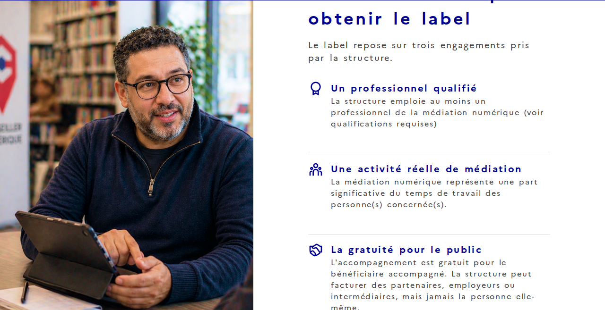
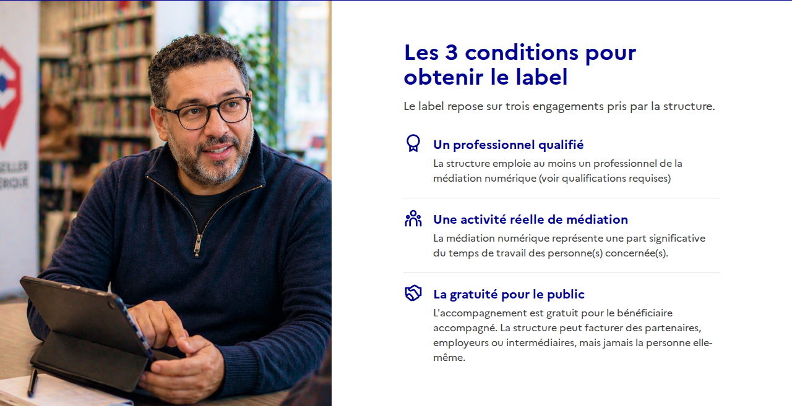
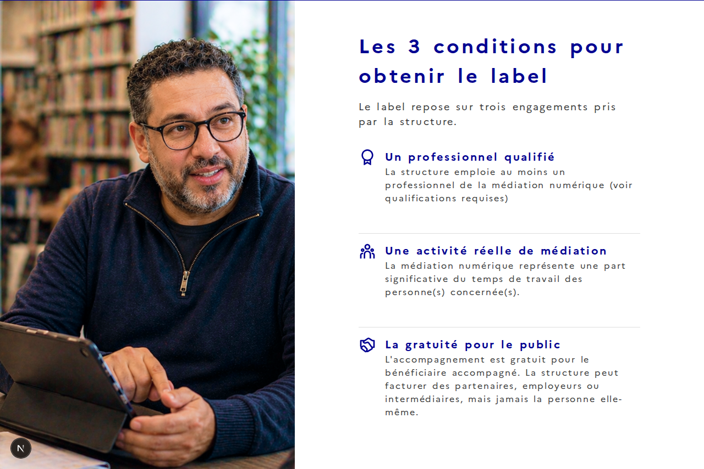

# Rapport de corrections RGAA — Conseiller Numérique (site vitrine)

Suivi des corrections apportées suite à l'audit RGAA 4.1.2 réalisé par Arya Access (21/09/2026). Chaque section correspond à un ticket du board MIN/SEPT et à sa PR associée.

**État global :** 10 PR fusionnées sur site-vitrine-conum (#4, #5, #7, #8, #10, #11, #13, #14, #26, #27 — #12 inclus dans #5) + 1 PR fusionnée sur le repo externe site-vitrine (#15, formulaire de candidature) · #6 fermé sans code (lien déjà correct) · #9 sans code applicatif à corriger ici (limitation DSFR, portée reformulée sitewide) · #16 (PDF charte graphique) encore ouvert, relais vers l'équipe design.

**Seconde passe d'audit (approfondie) :** une relecture indépendante du rapport complet (texte + captures d'écran) a été menée pour vérifier la couverture réelle des recommandations sur le code actuel. Elle a confirmé que tous les critères en périmètre étaient traités, à l'exception de 2 écarts ponctuels trouvés et corrigés (#26, #27) et d'un point d'amélioration facultatif (inclus dans #26). Voir la section [Résultat de la seconde passe d'audit](#résultat-de-la-seconde-passe-daudit) en bas de document.

Sommaire :
- [#4 — Statut d'accessibilité en pied de page](#4--statut-daccessibilité-en-pied-de-page)
- [#5 — Déclaration d'accessibilité officielle (+ #12)](#5--déclaration-daccessibilité-officielle--12)
- [#6 — Schéma pluriannuel d'accessibilité](#6--schéma-pluriannuel-daccessibilité)
- [#7 — Dimensions fixes ConditionsLabelSection (RGAA 10.12)](#7--dimensions-fixes-conditionslabelsection-rgaa-1012)
- [#8 — Alternative HTML accessible aux CGU (RGAA 13.3)](#8--alternative-html-accessible-aux-cgu-rgaa-133)
- [#9 — Second H1 masqué DSFR (RGAA 9.1)](#9--hiérarchie-des-titres-formation-rgaa-91)
- [#10 — Images décoratives + investigation Accueil (RGAA 1.2 / 8.9)](#10--images-décoratives--investigation-accueil-rgaa-12--89)
- [#11 — Lien explicite Formation (RGAA 6.1)](#11--lien-explicite-formation-rgaa-61)
- [#13 — Cohérence structurelle Plan du site (RGAA 9.2)](#13--cohérence-structurelle-plan-du-site-rgaa-92)
- [#14 — Rôles ARIA landmarks (RGAA 12.6)](#14--rôles-aria-landmarks-rgaa-126)
- [#26 — role="main" manquant sur /cgu (RGAA 12.6)](#26--role-main-manquant-sur-cgu-rgaa-126)
- [#27 — Aria-label explicite du fil d'ariane (RGAA 9.2)](#27--aria-label-explicite-du-fil-dariane-rgaa-92)
- [#15 — Formulaire de candidature conseiller (repo externe site-vitrine)](#15--formulaire-de-candidature-conseiller-repo-externe-site-vitrine)
- [Résultat de la seconde passe d'audit](#résultat-de-la-seconde-passe-daudit)

---

## #4 — Statut d'accessibilité en pied de page

**Ticket :** [#4](https://github.com/anct-cnum/site-vitrine-conum/issues/4) · **PR :** [#19](https://github.com/anct-cnum/site-vitrine-conum/pull/19) (fusionnée)

### Constat
`PiedDePage.tsx` avait `STATUT_ACCESSIBILITE = "non compliant"` codé en dur.

### Correctif
`"non compliant"` → `"partially compliant"` (le site est partiellement conforme suite à l'audit).

---

## #5 — Déclaration d'accessibilité officielle (+ #12)

**Ticket :** [#5](https://github.com/anct-cnum/site-vitrine-conum/issues/5) et [#12](https://github.com/anct-cnum/site-vitrine-conum/issues/12) · **PR :** [#23](https://github.com/anct-cnum/site-vitrine-conum/pull/23) (fusionnée)

### Constat
`/accessibilite` affichait un contenu placeholder ("non conforme", "Le site n'a encore pas été audité"). Le bloc "Amélioration et contact" listait l'e-mail/adresse en paragraphes distincts plutôt qu'en liste (RGAA 9.3, ticket #12).

### Correctif
- Publication de la déclaration officielle : 66,04 % des critères respectés (taux moyen 86,54 %), liste des 18 critères non conformes, environnement de test, technologies, outils, pages vérifiées.
- Conversion du bloc contact en `<ul>/<li>`.

### Vérification
Rendu contrôlé dans le navigateur : 18 critères affichés, un seul H1 visible (le second H1, masqué, appartient au sélecteur de thème DSFR — voir #9), aucune erreur console.

---

## #6 — Schéma pluriannuel d'accessibilité

**Ticket :** [#6](https://github.com/anct-cnum/site-vitrine-conum/issues/6) (fermé) · **Pas de PR nécessaire**

### Investigation
Un lien "Schéma pluriannuel" existe déjà sur `/accessibilite`, identique à deux autres entrées ("Plan 2025", "Bilan 2024") — contenu non vérifiable par requête HTTP simple (application JS `docs.numerique.gouv.fr`).

### Résolution
Confirmé par l'équipe : le document lié est bien le **« Schéma pluriannuel d'accessibilité de l'incubateur des territoires 2025-2027 »**, valide et à jour (couvre l'ensemble des services de l'incubateur, dont Conseiller Numérique). Lien déjà correct sur le site, aucun correctif nécessaire. Ticket fermé.

---

## #7 — Dimensions fixes ConditionsLabelSection (RGAA 10.12)

**Ticket :** [#7](https://github.com/anct-cnum/site-vitrine-conum/issues/7) · **PR :** [#17](https://github.com/anct-cnum/site-vitrine-conum/pull/17) (fusionnée) · **Sévérité :** Bloquant

### Constat
`ConditionsLabelSection.module.scss` utilisait `height: 41rem` (section) et `width: 32rem` (bloc texte) fixes. Avec les propriétés d'espacement de texte RGAA (line-height, letter-spacing, word-spacing) redéfinies par l'utilisateur, le contenu débordait de la boîte : titre tronqué, dernier item coupé.

### Correctif
- `height: 41rem` → `min-height: 41rem`
- `width: 32rem` → `width: 100%; max-width: 32rem`

### Périmètre
Ce critère (10.12) concerne aussi un second exemple de l'audit sur la page **Candidature** (panneau récapitulatif "EN RÉSUMÉ"), hors périmètre de ce repo (sous-domaine externe). Signalé dans le ticket de relais [#15](https://github.com/anct-cnum/site-vitrine-conum/issues/15).

### Captures

**Avant correctif (reconstitué), espacement de texte RGAA appliqué — bug reproduit :**



**Après correctif, rendu normal — identique au design original :**



**Après correctif, espacement de texte RGAA appliqué — plus de troncature :**



---

## #8 — Alternative HTML accessible aux CGU (RGAA 13.3)

**Ticket :** [#8](https://github.com/anct-cnum/site-vitrine-conum/issues/8) · **PR :** [#25](https://github.com/anct-cnum/site-vitrine-conum/pull/25) (fusionnée) · **Sévérité :** Bloquant

### Constat
`public/documents/CGU-Données_personnellesConseiller_Numérique.pdf` (10 pages) n'est pas balisé (`pdfinfo` : `Tagged: no`), sans structure de lecture pour les technologies d'assistance.

### Correctif
Nouvelle page `/cgu` retranscrivant fidèlement l'intégralité du PDF (CGU de la plateforme + notice de traitement des données personnelles) en HTML structuré : titres h1→h4 hiérarchisés, listes, 2 tableaux DSFR accessibles (durée de conservation, sous-traitants), liens explicites. Le PDF original reste disponible en téléchargement depuis cette page. Le lien en pied de page (auparavant direct vers le PDF) cible désormais `/cgu`.

### Vérification
Hiérarchie de titres testée dans le navigateur : h1→h2→h3→h4 cohérente sur les 26 titres de la page, aucun saut. 2 tableaux rendus correctement, aucune erreur console.

---

## #9 — Hiérarchie des titres Formation (RGAA 9.1)

**Ticket :** [#9](https://github.com/anct-cnum/site-vitrine-conum/issues/9) · **Pas de PR**

### Investigation
La hiérarchie des titres propres à la page `/formation` est correcte (h1→h2→h3, aucun saut). Un second `<h1>` ("Paramètres d'affichage") a été trouvé dans le DOM rendu — il appartient au sélecteur de thème du DSFR (`headerFooterDisplayItem`), présent sur toutes les pages du site, contenu dans une `<dialog>` native fermée (`visibility: hidden`). Les navigateurs excluent normalement un `<dialog>` fermé de l'arbre d'accessibilité ; un outil comme HeadingsMap (cité par l'auditeur) lit en revanche le DOM brut, ce qui explique probablement le signalement.

### Pourquoi aucune PR
Ce H1 vient du code interne de la librairie DSFR (`node_modules`), pas du code applicatif. Voir le commentaire détaillé sur le ticket pour la décision à prendre (accepter comme limitation connue vs. signaler au mainteneur DSFR).

---

## #10 — Images décoratives + investigation Accueil (RGAA 1.2 / 8.9)

**Ticket :** [#10](https://github.com/anct-cnum/site-vitrine-conum/issues/10) · **PR :** [#22](https://github.com/anct-cnum/site-vitrine-conum/pull/22) (fusionnée — ticket #10 laissé ouvert, vérification lecteur d'écran recommandée)

### Constat
Plusieurs images décoratives (`alt=""`) sans `aria-hidden="true"` : `HeroSection`, `ConditionsLabelSection`, `FormationInitialeSection`, `ProgrammeSection`, et surtout `BlocTexteImageSection` — utilisé deux fois sur l'Accueil, identifié comme la cause la plus probable du signalement RGAA sur cette page (l'audit ne fournissait pas de capture précise).

### Correctif
Ajout de `aria-hidden="true"` (ou conditionnel `aria-hidden={alt === "" ? true : undefined}`) sur les 5 composants concernés.

### Correctif complémentaire (8.9 — texte structuré uniquement par un `<div>`)
Relecture du rapport d'audit (section 2.5.2) : le composant DSFR `Tile` (utilisé par `RessourcesSection`, 6 cartes sur l'Accueil) restitue sa prop `desc` dans un `<div class="fr-tile__desc">` sans balise `<p>`. Correctif : `desc={ressource.description}` → `desc={<p>{ressource.description}</p>}`. Vérifié dans le navigateur sur les 6 cartes.

---

## #11 — Lien explicite Formation (RGAA 6.1)

**Ticket :** [#11](https://github.com/anct-cnum/site-vitrine-conum/issues/11) · **PR :** [#21](https://github.com/anct-cnum/site-vitrine-conum/pull/21) (fusionnée)

### Constat
Le lien "En savoir plus" (remplacement du titre REMN) ne permettait pas de comprendre sa destination hors contexte.

### Correctif
Ajout d'un texte `fr-sr-only` précisant la destination, sans changer le rendu visuel.

---

## #13 — Cohérence structurelle Plan du site (RGAA 9.2)

**Ticket :** [#13](https://github.com/anct-cnum/site-vitrine-conum/issues/13) · **PR :** [#24](https://github.com/anct-cnum/site-vitrine-conum/pull/24) (fusionnée)

### Constat
`CarteTexte` (composant partagé) est utilisé avec `as="article"` par défaut partout, sauf Plan du site qui forçait `as="div"` sans raison apparente, perdant le landmark `<article>`.

### Correctif
Retrait de l'override `as="div"`.

---

## #14 — Rôles ARIA landmarks (RGAA 12.6)

**Ticket :** [#14](https://github.com/anct-cnum/site-vitrine-conum/issues/14) · **PR :** [#20](https://github.com/anct-cnum/site-vitrine-conum/pull/20) (fusionnée)

### Investigation
Les `<nav>` du DSFR (Header, SkipLinks, Breadcrumb) ont déjà `role="navigation"` nativement — rien à corriger côté navigation. Aucune balise `<main>` n'avait de `role="main"` explicite.

### Correctif
Ajout de `role="main"` sur la balise `<main id="content">` des 10 pages du site.

---

## #26 — role="main" manquant sur /cgu (RGAA 12.6)

**Ticket :** [#26](https://github.com/anct-cnum/site-vitrine-conum/issues/26) (fermé) · **PR :** [#28](https://github.com/anct-cnum/site-vitrine-conum/pull/28) (fusionnée)

### Constat
Trouvé lors de la seconde passe d'audit approfondie : `app/cgu/page.tsx` (créé par #8, fusionné **après** #14 qui avait ajouté `role="main"` aux 10 pages existant à ce moment-là) n'avait pas repris ce pattern — régression ponctuelle non détectée par les tickets initiaux.

### Correctif
- Ajout de `role="main"` sur `app/cgu/page.tsx`
- Bonus à coût nul (même passe d'audit) : ajout d'une prop `ctaSrOnlyContext` sur `BlocTexteImageSection` pour renforcer le contexte du lien "En savoir plus" de l'Accueil — déjà conforme via le h2 précédent immédiat, mais fragile si du contenu venait s'intercaler entre le titre et le lien.

---

## #27 — Aria-label explicite du fil d'ariane (RGAA 9.2)

**Ticket :** [#27](https://github.com/anct-cnum/site-vitrine-conum/issues/27) (fermé) · **PR :** [#29](https://github.com/anct-cnum/site-vitrine-conum/pull/29) (fusionnée)

### Constat
Trouvé lors de la seconde passe d'audit approfondie : c'est littéralement l'exemple illustrant le critère 9.2 dans le rapport source (page 21), jamais rapproché du code lors du ticket #13. Le composant DSFR `Breadcrumb` rend en dur `aria-label="vous êtes ici :"`.

### Correctif
Surcharge globale via l'API i18n du DSFR (`app/layout.tsx`) :
```ts
addBreadcrumbTranslations({
  lang: "fr",
  messages: { "navigation label": "Fil d'ariane" },
});
```
Vérifié dans le navigateur : `aria-label="Fil d'ariane :"` sur `/plan-du-site`.

---

## #15 — Formulaire de candidature conseiller (repo externe site-vitrine)

**Ticket :** [#15](https://github.com/anct-cnum/site-vitrine-conum/issues/15) (fermé) · **Repo :** [anct-cnum/site-vitrine](https://github.com/anct-cnum/site-vitrine) · **PR :** [#356](https://github.com/anct-cnum/site-vitrine/pull/356) (fusionnée le 07/10/2026)

### Contexte
Le formulaire de candidature conseiller (`/candidature-conseiller`) vit sur un repo séparé (`anct-cnum/site-vitrine`, React + Vite + Redux, distinct de ce repo Next.js) et concentrait la majorité des non-conformités de l'audit initial (2.2, 10.12 partiel, 11.2, 11.5, 11.10, 11.11, 11.13). Recodage lancé via un worktree Orca dédié avec un agent Claude, briefé sur le contrat d'API à préserver (`POST /candidature-conseiller`, payload `CandidatureConseillerInput` inchangé) et les non-conformités précises trouvées en lisant le code source.

### Correctifs (un commit par critère)
- **2.2** — Turnstile forcé en `language: 'fr'` (titre d'iframe explicite), widget englobé dans `role="group"` nommé
- **10.12** — `.fr-notice__body` (encart "En résumé") passé en `flex-direction: column` ; débordement horizontal à 320px avec espacements RGAA corrigé
- **11.2** — Label du champ date remplacé par la vraie question (au lieu de "Choisir une date" générique)
- **11.5** — Groupes "situations"/"expérience"/"distance" nommés via `role="group"`/`role="radiogroup"` + `aria-labelledby`
- **11.10** — Bug réel trouvé : `id` d'erreur codé en dur et dupliqué sur tous les champs, aucun `aria-describedby`. Corrigé : `id` unique par champ + `aria-describedby` + `aria-invalid`
- **11.11** — Nouvelle prop `formatAttendu`, ajoutée au message d'erreur en cas d'erreur de format (email, téléphone)
- **11.13** — `autoComplete="on"` générique → `given-name`/`family-name`/`email`/`tel`

### Vérification
Lint OK, 84 tests passent (80 avant, nouveaux tests par correctif), parcours navigateur complet avec requête API interceptée (aucune candidature réellement envoyée), payload conforme au contrat.

### Reste à faire (hors périmètre de cette PR)
- Décision produit : un texte d'aide dupliqué par copier-coller fait désormais partie du nom accessible du champ date — à reformuler
- Formulaires structure et coordinateur : partagent les mêmes composants donc héritent de 11.10/11.13/2.2, mais leurs problèmes propres (11.2/11.5/10.12) n'ont pas été vérifiés
- Largeur fixe de 300px du widget Turnstile (imposée par Cloudflare), touche les bords à 320px — non actionnable

---

## Résultat de la seconde passe d'audit

Une relecture indépendante et complète des 35 pages du rapport d'audit (texte **et** captures d'écran, y compris les recommandations données uniquement en image) a été menée pour vérifier, section par section, que le code actuel du site couvrait bien chaque recommandation en périmètre (hors formulaire de Candidature externe et hors PDF de charte graphique).

**Constat global : tous les critères en périmètre sont couverts.** Seuls 2 écarts ponctuels ont été trouvés, tous deux introduits par des changements ultérieurs à leurs tickets d'origine (pages/composants créés ou modifiés après coup sans reprendre un pattern déjà établi ailleurs) — pas des oublis dans l'analyse initiale du rapport lui-même :
- **#26** — `role="main"` manquant sur `/cgu` (page créée après le fix sitewide #14)
- **#27** — `aria-label` du fil d'ariane non explicite (exemple de l'audit jamais rapproché du composant DSFR `Breadcrumb`)

Plus un point d'amélioration facultatif (coût nul, inclus dans #26) et une clarification de portée sur #9 (le second H1 masqué du sélecteur de thème DSFR concerne toutes les pages, pas seulement Formation — même diagnostic et même limitation, juste un intitulé de ticket corrigé).

Un balayage systématique de tous les liens/boutons non-explicites du site a également été fait à cette occasion (au-delà du seul critère 6.1 relevé par l'audit) : aucun lien réellement non-conforme trouvé au-delà de celui déjà corrigé par #11.

---
